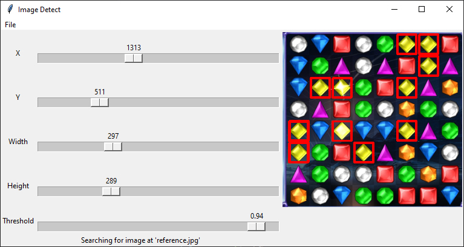

# Image Detect
## Background
This application plays a sound and highlights it when it has detected a reference image (`reference.jpg`) in the image that is being scanned. The application performs a simple screenshot poll to scan the image.

## Example Usage
One could use this to detect a gem in a game of Bejeweled.

If using this as a reference image,


The following will be highlighted and a sound would be played,



## Setup
Install Tkinter through normal Python distribution. The other dependencies may be installed through `pip`.
```sh
pip install -r requirements.txt
```

The image to be found needs to be at the root folder with name `reference.jpg`. The sound it will play is `beep.wav`. You may replace the image and sound but the names are currently hardcoded.

## Run

### Python
Simply run the script with Python with the following call.
```sh
python main.py
```

### Build Executable
To make it a standalone executable, use PyInstaller and build with the recommended command below.
```sh
pyinstaller main.py --windowed --onefile
```

## Potential Improvements
- All error handling.
    - Reference image.
    - Sound file.
- Import reference at run-time.
- Add mask option to template matching.
- The image may be matched several times without a padded block out.
- Adjustments are too coarse.
- Adjustable refresh rate.